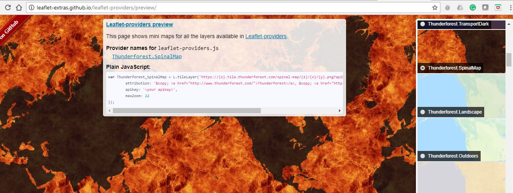

# Airportmap
The link for map is: [Airportmap](https://farahanimajid.github.io/airportmap/)
</hr>

**Interactive Map Design for all airports and states in U.S.**

>  Geovisualization: Geovisual Analytics/lab3


**Introduction:**
In this project, we creat a thematic map of  airports in each state in the United States.


When creating a web map, one of the key components is styling your elements
 to provide proper symbolization for data.
 This increases legibility for users and can give our map an appealing, custom design.
  Elements that can be custom designed include thematic layers (i.e., points, lines,
and polygons), base maps
   (as a leaflet `tileLayer`), interactive features (the components of the map that allow
    for user interaction),
    and legends and supplemental information (such as credits, etc.).

The spatial distribution of Airports is from
[DATA.GOV](https://catalog.data.gov/dataset/usgs-small-scale-dataset-airports-of-the-united-states-201207-shapefile).


[**This**](https://farahanimajid.github.io/airportmap/) is the final web map we will make in this project.

[](https://farahanimajid.github.io/airportmap/)

**All CSS libraries:**

There are four css file that we use for this project. First main1.css that you can find in css folder and 
also three other css libraries from font-awesome(Font Awesome allows you to add icons by CSS classes),
 leaflet and googleapis( In order to ensure that every visitors computer display the same, you can link to this online font libraries).
```
<link rel="stylesheet" href="css/main1.css"/>
<link rel="stylesheet" href="https://unpkg.com/leaflet@1.3.1/dist/leaflet.css"/>
<link rel="stylesheet" href="https://cdnjs.cloudflare.com/ajax/libs/font-awesome/4.7.0/css/font-awesome.css"/>
<link href="https://fonts.googleapis.com/css?family=Titillium+Web" rel="stylesheet">
```

**All javascript libraries:**

There are nine diferent script file thet we listed below. we need to include a Javascript
library leaflet.ajax in the head element. This library will be used to asynchronously read GeoJson data.
 We use chroma.js to colorize the icon, and utilize $ of jQuery to manipulate html elements.
  Chroma.js is a javascript library to manipulate colors. Therefore, we need to include both chroma.js and
   jQuery in the head tag.
   
   The label function is supported by the Label Gun library, which is a mapping library agnostic labelling 
   engine. It allows you to avoid cluttering in mapping popups and labels, providing precedence to labels 
   of your choice.
   
   In order to use custom project, we need two necessary libraries proj4js and proj4leaflet after the leaflet.js
```
    <script src="https://ajax.googleapis.com/ajax/libs/jquery/3.1.0/jquery.min.js"></script>
    <script src="https://cdnjs.cloudflare.com/ajax/libs/chroma-js/1.3.4/chroma.min.js"></script>
    <script src="https://unpkg.com/rbush@2.0.1/rbush.min.js"></script>
    <script src="https://unpkg.com/labelgun@6.0.0/lib/labelgun.min.js"></script>
    <script src="https://unpkg.com/leaflet@1.3.1/dist/leaflet.js"></script>
    <script src="https://cdnjs.cloudflare.com/ajax/libs/proj4js/2.4.4/proj4.js"></script>
    <script src="https://cdnjs.cloudflare.com/ajax/libs/proj4leaflet/1.0.2/proj4leaflet.min.js"></script>
    <script src="https://cdnjs.cloudflare.com/ajax/libs/leaflet-ajax/2.1.0/leaflet.ajax.min.js"></script>
    <script type="text/javascript" src="https://cloudybay.github.io/leaflet.latlng-graticule/leaflet.latlng-graticule.js"></script>
```
 **Set up our Map and Add Data:**
```
// 1. Create a map object.
    var mymap = L.map('map', {
        center: [39.62, -100.85],
        zoom: 5,
        maxZoom: 17,
        minZoom: 3,
        detectRetina: true // detect whether the sceen is high resolution or not.
    });
```
**Base map**
The base map is provided by CartoDBthe and we used open street base
map for this project. [Leaflet providers](http://leaflet-extras.github.io/leaflet-providers/preview/)



**Add the airport Data**

For add the airport dataset to the map.
First, we need to include another Javascript library
 [`leaflet.ajax`](https://github.com/calvinmetcalf/leaflet-ajax) in the `head` element. This
  library will be used to asynchronously read `GeoJson` data.

```html
<script src="https://cdnjs.cloudflare.com/ajax/libs/leaflet-ajax/2.1.0/leaflet.ajax.min.js"></script>
```


**Point Marker Visualization**
 Create the color scheme for markers:
we prepare custom icon using **Font Awesome** and make color scheme with **Chroma.js**.

[**Font Awesome**](http://fontawesome.io/) allows us to add icons by CSS classes.
To apply Font Awesome, you will need to include its css link in the `head`
element of the web map.

```html
<link rel="stylesheet" href="https://cdnjs.cloudflare.com/ajax/libs/font-awesome/4.7.0/css/font-awesome.css"/>
```

In addition, we will use another library `chroma.js` to colorize the icon, and utilize
 `$` of `jQuery` to manipulate `html` elements to add the colored icons.
 [Chroma.js](https://gka.github.io/chroma.js/) is a javascript library to manipulate colors
 . Therefore, we need to include both `chroma.js` and `jQuery` in the head tag.

```html
<script src="https://ajax.googleapis.com/ajax/libs/jquery/3.1.0/jquery.min.js"></script>
<script src="https://cdnjs.cloudflare.com/ajax/libs/chroma-js/1.3.4/chroma.min.js"></script>
```

Furthermore, we also need some predefined color ramp to symbolize geographic features.
We are using Chroma to draw from color ramps created by [ColorBrewer](http://colorbrewer2.org/),
 an online tool designed to help people select good color schemes for maps and other graphics.
  It provides three types of palettes: sequential, diverging and qualitative.


 **color palette:**
```
// 6. Set function for color ramp
    colors = chroma.scale('OrRd').colors(10); //colors = chroma.scale('OrRd').colors(5);

    function setColor(density) {
        var id = 0;
        if (density > 45) { id = 9; }
        else if (density > 40 && density <= 45) { id = 8; }
        else if (density > 35 && density <= 40) { id = 7; }
        else if (density > 30 && density <= 35) { id = 6; }
        else if (density > 25 && density <= 30) { id = 5; }
        else if (density > 20 && density <= 25) { id = 4; }
        else if (density > 15&&  density <= 20) { id = 3; }
        else if (density > 10&&  density <= 15) { id = 2; }
        else if (density > 5&&  density <= 10) { id = 1; }
        else  { id = 0; }
        return colors[id];
    }
```

 **Add a Legend:**
we used the below code to add Legend

```

    // 9. Create Leaflet Control Object for Legend
    var legend = L.control({position: 'topright'});

    // 10. Function that runs when legend is added to map
    legend.onAdd = function () {

        // Create Div Element and Populate it with HTML
        var div = L.DomUtil.create('div', 'legend');
        div.innerHTML += '<b># Airports in U.S States</b><br />';
        div.innerHTML += '<i style="background: ' + colors[9] + '; opacity: 0.5"></i><p>45+</p>';
        div.innerHTML += '<i style="background: ' + colors[8] + '; opacity: 0.5"></i><p>40-45</p>';
        div.innerHTML += '<i style="background: ' + colors[7] + '; opacity: 0.5"></i><p>35-40</p>';
        div.innerHTML += '<i style="background: ' + colors[6] + '; opacity: 0.5"></i><p>30-35</p>';
        div.innerHTML += '<i style="background: ' + colors[5] + '; opacity: 0.5"></i><p>25-30</p>';
        div.innerHTML += '<i style="background: ' + colors[4] + '; opacity: 0.5"></i><p>20-25</p>';
        div.innerHTML += '<i style="background: ' + colors[3] + '; opacity: 0.5"></i><p>15-20</p>';
        div.innerHTML += '<i style="background: ' + colors[2] + '; opacity: 0.5"></i><p>10-15</p>';
        div.innerHTML += '<i style="background: ' + colors[1] + '; opacity: 0.5"></i><p> 5-10</p>';
        div.innerHTML += '<i style="background: ' + colors[0] + '; opacity: 0.5"></i><p> 0- 5</p>';
        div.innerHTML += '<hr><b>airport<b><br />';
        div.innerHTML += '<i class="fa fa-plane marker-color-1"></i><p> With tower</p>';
        div.innerHTML += '<i class="fa fa-plane marker-color-2"></i><p> Whithout tower</p>';
        // div.innerHTML += '<i class="fa fa-signal marker-color-3"></i><p> RCC Minnesota</p>';
        // div.innerHTML += '<i class="fa fa-signal marker-color-4"></i><p> Verizon</p>';
        // div.innerHTML += '<i class="fa fa-signal marker-color-5"></i><p> US Cellular</p>';
        // div.innerHTML += '<i class="fa fa-signal marker-color-6"></i><p> Hood River Cellular</p>';
        // div.innerHTML += '<i class="fa fa-signal marker-color-7"></i><p> Medford Cellular</p>';
        // div.innerHTML += '<i class="fa fa-signal marker-color-8"></i><p> Oregon RSA</p>';
        // div.innerHTML += '<i class="fa fa-signal marker-color-9"></i><p> Salem Cellular</p>';
        // Return the Legend div containing the HTML content
        return div;
    };

    // 11. Add a legend to map
    legend.addTo(mymap);
```


 **Add a Scale Bar:**


we used the below code to add scale bar

```
L.control.scale({position: 'bottomleft'}).addTo(mymap);
```
  Reproject a web map: 
```
    L.latlngGraticule({
        showLabel: true,
        opacity: 0.2,
        color: "#747474",
        zoomInterval: [
            {start: 2, end: 7, interval: 2},
            {start: 8, end: 11, interval: 0.5}
        ]
    }).addTo(mymap);

```


 **creating lable:** 

```
    // 15. Create a label for each state.
    var usstates = null;
    usstates = L.geoJson.ajax("assets/us-states.geojson", {
        style: style,
        onEachFeature: function (feature, label) {
            label.bindTooltip(feature.properties.NAME, {className: 'feature-label', permanent:true, direction: 'center'});
            labels.push(label);
        }
    }).addTo(mymap);

    //16.  create an addLabel function to dynamically update the visible labels, aiming to avoid the lable overlap.
    function addLabel(layer, id) {
        // This is ugly but there is no getContainer method on the tooltip :(
        var label = layer.getTooltip()._source._tooltip._container;
        if (label) {
            // We need the bounding rectangle of the label itself
            var rect = label.getBoundingClientRect();

            // We convert the container coordinates (screen space) to Lat/lng
            var bottomLeft = mymap.containerPointToLatLng([rect.left, rect.bottom]);
            var topRight = mymap.containerPointToLatLng([rect.right, rect.top]);
            var boundingBox = {
                bottomLeft : [bottomLeft.lng, bottomLeft.lat],
                topRight   : [topRight.lng, topRight.lat]
            };

            // Ingest the label into labelgun itself
            labelEngine.ingestLabel(
                boundingBox,
                id,
                parseInt(Math.random() * (5 - 1) + 1), // Weight
                label,
                label.innerText,
                false
            );

            // If the label hasn't been added to the map already
            // add it and set the added flag to true
            if (!layer.added) {
                layer.addTo(mymap);
                layer.added = true;
            }
        }

    }

    //17. We will update the visualization of the labels whenever you zoom the map.

    mymap.on("zoomend", function(){
        var i = 0;
        usstates.eachLayer(function(label){
            addLabel(label, ++i);
        });
        labelEngine.update();
    });
    // 18. define the coordinate reference system (CRS)
    mycrs = new L.Proj.CRS('EPSG:2991',
        '+proj=lcc +lat_1=43 +lat_2=45.5 +lat_0=41.75 +lon_0=-120.5 +x_0=400000 +y_0=0 +ellps=GRS80 +datum=NAD83 +units=m +no_defs',
        {
            resolutions: [8192, 4096, 2048, 1024, 512, 256, 128, 64, 32, 16, 8, 4, 2, 1] // example zoom level resolutions
        }
    );
``` 


